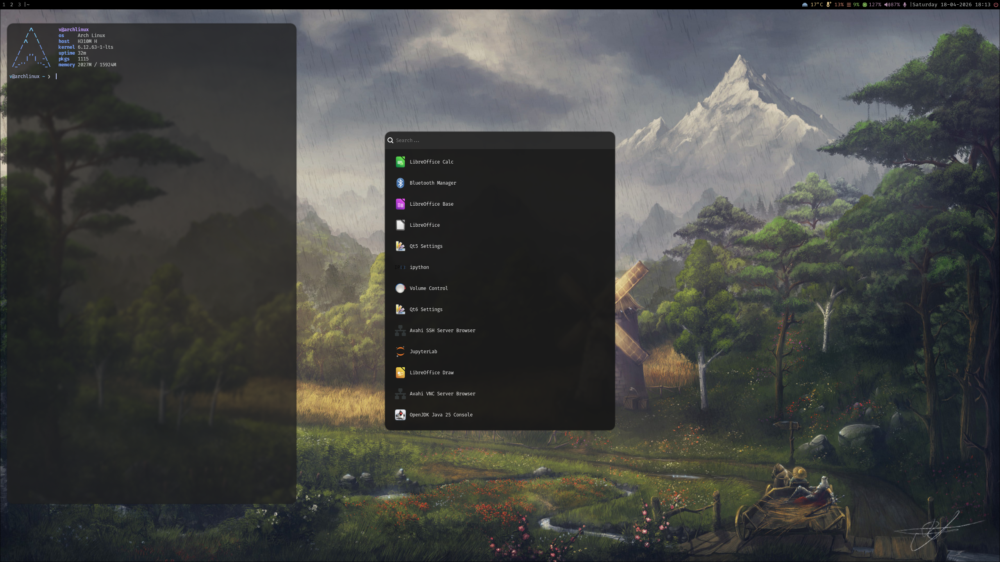
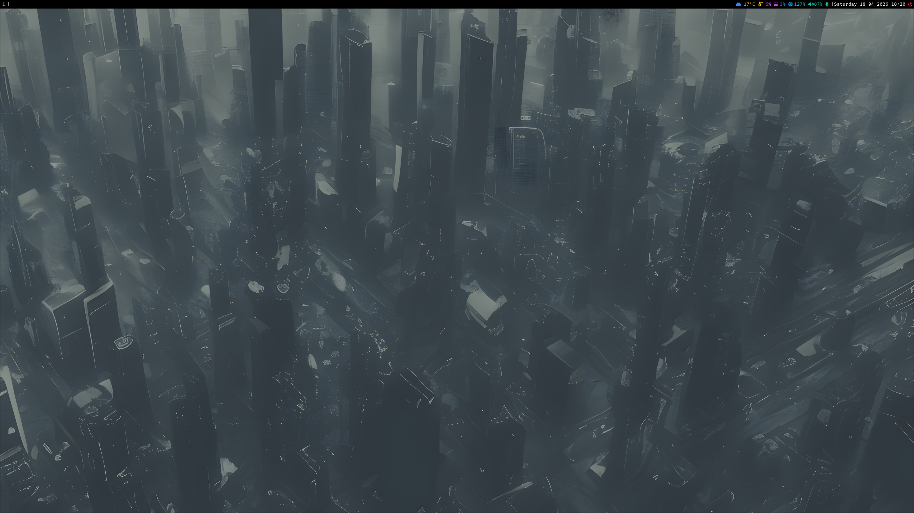
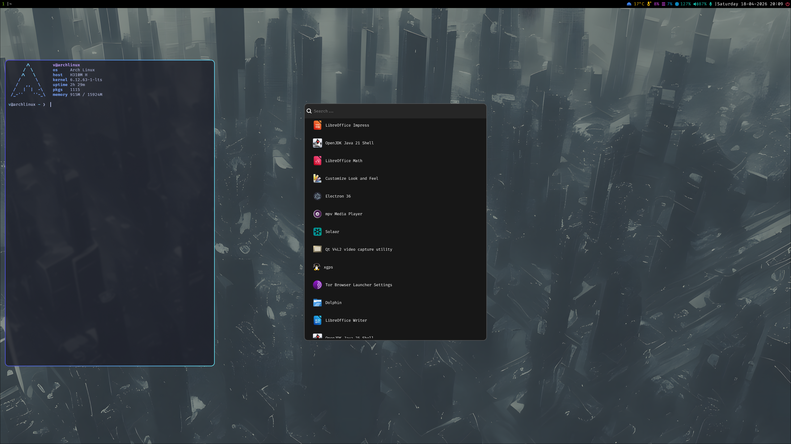
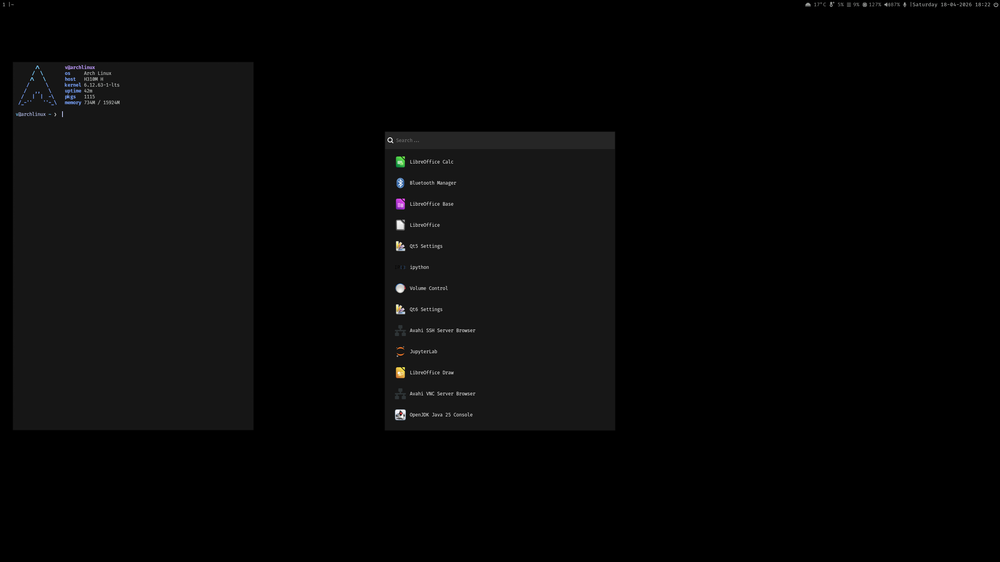

# 🧩 Hyprland Dotfiles

🌍 Language: [Español](README.es.md) | **English**

Hyprland configuration with multiple themes and environment customization.

---

## 🎨 Themes

This repository includes three configurations:

* **Field** → clean style with natural background
* **Blue** → dark and minimal environment
* **Minimal** → lightweight and basic setup

Each theme includes:

* Hyprland
* Waybar
* Kitty
* Wofi

---

## 📸 Previews

### 🌿 Field




---

### 🌙 Blue




---

### ⚪ Minimal




---

## ⌨️ Keybindings

| Key                 | Action                   |
| ------------------- | ------------------------ |
| mod + Q             | launch terminal          |
| mod + R             | open launcher (wofi)     |
| mod + E             | open file manager        |
| mod + C             | close window             |
| mod + V             | toggle floating          |
| mod + F             | fullscreen               |
| mod + arrows        | move focus               |
| mod + [1–0]         | switch workspace         |
| mod + shift + [1–0] | move window to workspace |
| mod + mouse         | move/resize windows      |
| mod + P             | screenshot (full)        |
| mod + shift + P     | screenshot (region)      |
| mod + U             | toggle waybar            |
| mod + M             | exit session             |

---

## ⚙️ Usage

Clone the repository:

```bash id="en1"
git clone https://github.com/valentintelleria/dotfiles
cd dotfiles
```

Copy the desired theme to `~/.config`:

```bash id="en2"
cp -r themes/Field/* ~/.config/
```

(Change `Field` to `Blue` or `Minimal`)

---

## 🧠 Notes

* Personal configuration, may require adjustments
* Some paths and settings depend on your system (monitor, wallpapers, etc.)
